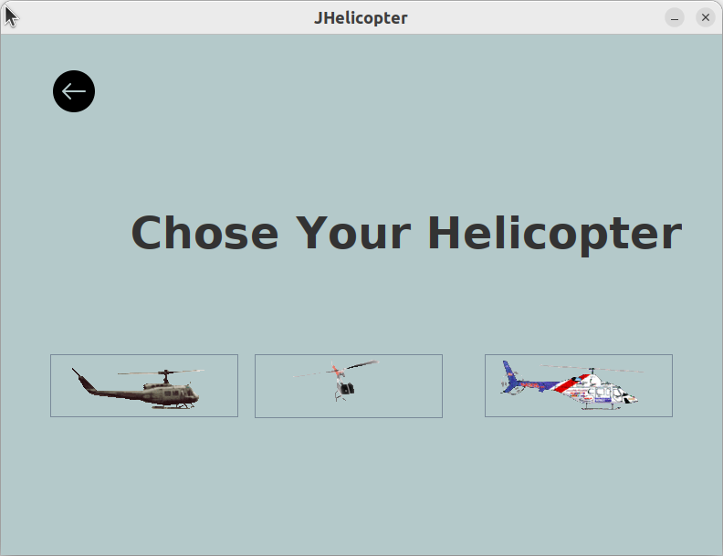
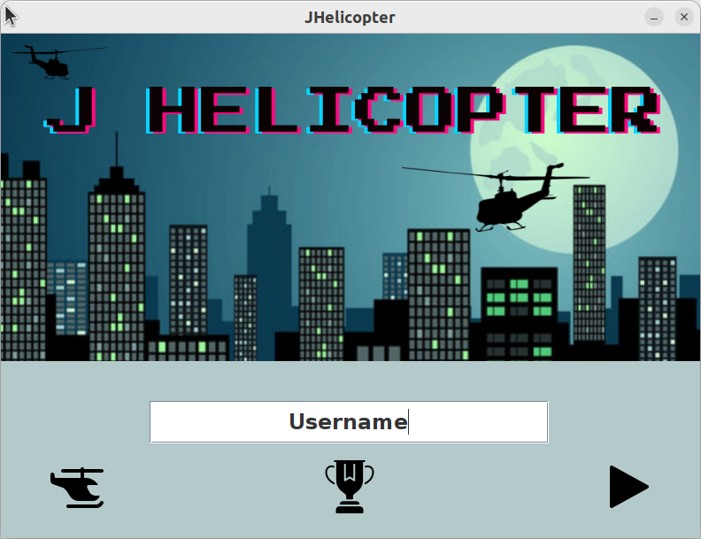
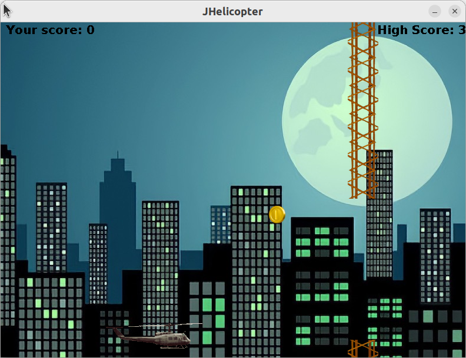
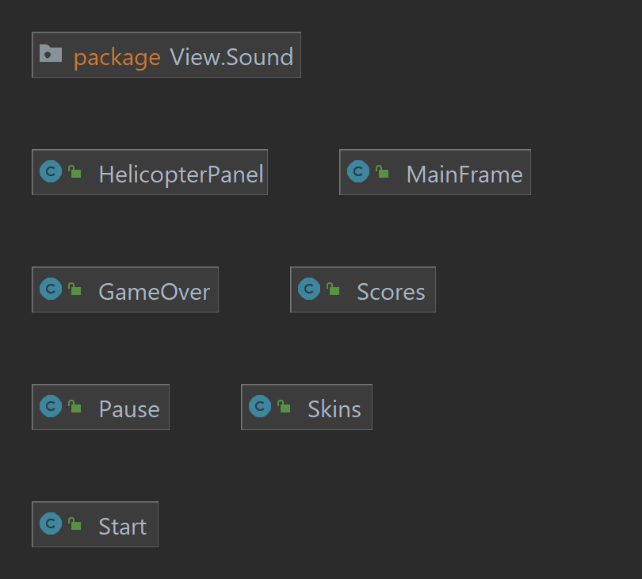
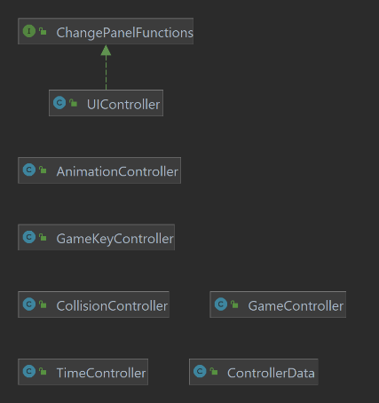
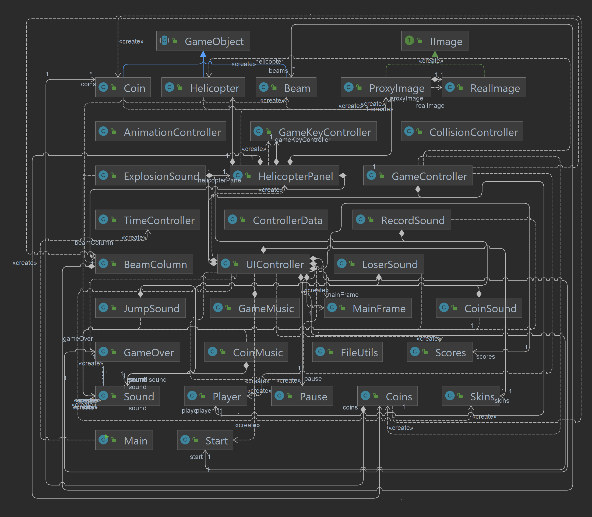

# JHelicopter
The aim of this project is the development of a desktop application, named JHelicopter, which implements a modified version of the graphics from the well-known video game "Flappy Bird."

The application is implemented using JFC/Swing technology to promote broad portability across different operating systems (platforms), minimizing the need for any significant changes to the source code.

## Application Screenshots Showcase
   

## System Software Architecture
For the development of the application, an MVC (Model, View, Controller) approach has been adopted.

### UML Diagrams 
| Model | View | Controller |
|-------|------|------------|
| |  | |

### Global UML Diagram


## How to run the application
### Windows
You need only to duble click on the `JHelicopter.exe` file located in the `dist` folder.

### Unix based systems
Move to the `dist` folder and run the following commands:
```bash
chmod +x JHelicopter.sh
./JHelicopter.sh
```
## Pre-requisites
- Java Development Kit (JDK) 18 or higher
- Java Runtime Environment (JRE) 18 or higher

## Other Information About The Project

## Additional Information
For more details about the project, please refer to the [report](report/report.pdf) file. Please note that the report is written in Italian.

## Authors
- Leonardo Ignazio Pagliochini
- Erigen Partalli

