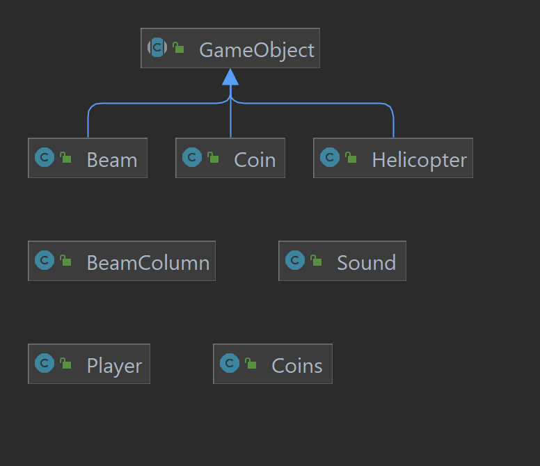

# JHelicopter
The aim of this project is the development of a desktop application, named JHelicopter, which implements a modified version of the graphics from the well-known video game "Flappy Bird."

The application is implemented using JFC/Swing technology to promote broad portability across different operating systems (platforms), minimizing the need for any significant changes to the source code.

## Application Screenshots Showcase

## System Software Architecture
For the development of the application, an MVC (Model, View, Controller) approach has been adopted.

### UML Diagrams 
| Model | View | Controller |
|-------|------|------------|
| |  | |

### Global UML Diagram

